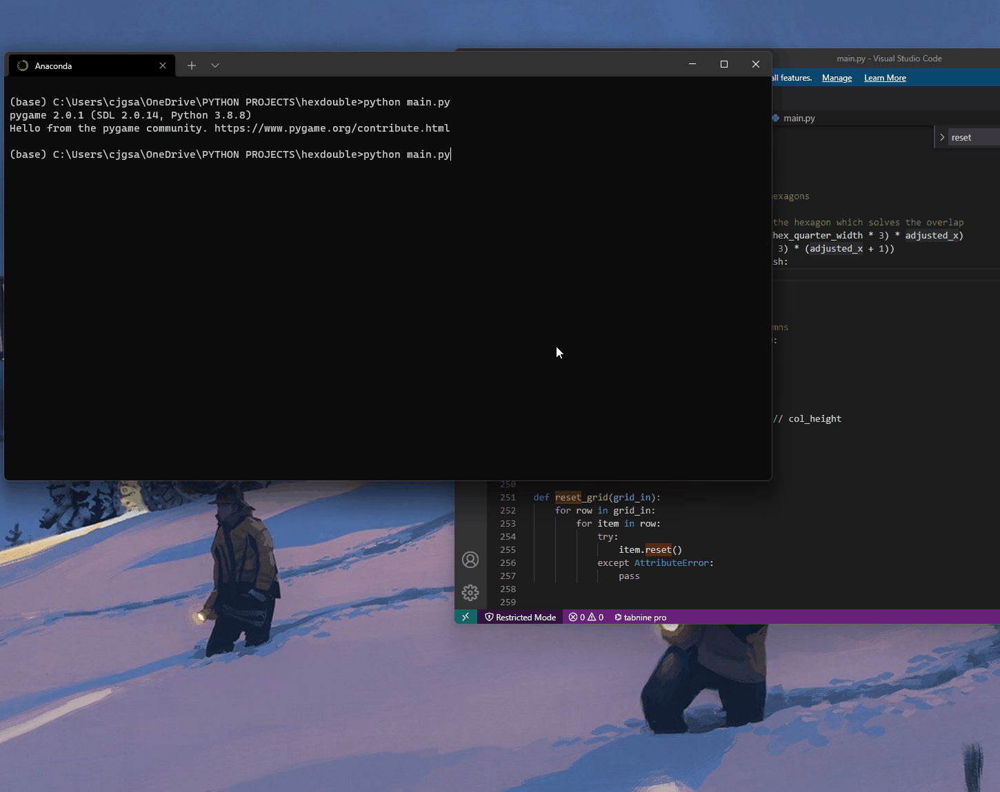

# hex_search

I built this while learning about different AI search algorithms.

This is an implementation of Depth First Search (A* algorithm) and Breadth First Search.

It uses a hexagonal grid since this accurately models the real word. Hexagons fit into a sphere, squares don’t.

Hexagonal grids are offset, so I offset the nodes in the data structure. This leads to some wasted space with empty nodes in the data structure but is simple to visualise the coordinates. 

Settings can be adjusted through the file.

--------Controls--------
left click to place the start
left click again to place the goal
left click again to place walls
right click to erase a hex
c to clear everything

--------Update--------

I added a mode where the red hexagon will chase the green.

--------Controls--------

W A S D Q E to move.
Enter to start the chase

--------Further Development--------

I would like to add a GUI to adjust and display settings

